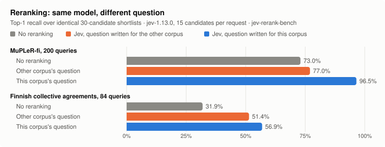

# Jev Skills

Agent skills for building with [Jev](https://typesafe.ai/), TypeSafe's model for typed decisions.
Jev returns choices, scores and yes probabilities that code acts on; use an LLM when you need generated text.
The [official skill](https://github.com/typesafe-ai/skills) covers the API. These cover the rest:
where a decision fits, how to word the question, what code does with the answer, and how to show it works.

## Install

```sh
npx skills add typesafe-ai/skills --skill typesafe-ai
npx skills add laguagu/jev-skills --skill jev-builder
```

Choose your agent when prompted, or add `--agent codex`. [Claude Code plugin and other options](INSTALL.md).
Live calls need a `TYPESAFE_API_KEY` from the [TypeSafe console](https://console.typesafe.ai);
installing a skill makes no API calls.

## Measured, not assumed



The skills' advice comes from [jev-rerank-bench](https://github.com/laguagu/jev-rerank-bench),
five benchmarks on Finnish text run for this kit in September 2026:

| Benchmark | What the skills take from it |
| --- | --- |
| [Reranking](https://github.com/laguagu/jev-rerank-bench#1-reranking) | On MuPLeR-fi, top-1 was 73.0% with no reranking, 77.0% with Jev asked the question written for the other corpus, and 96.5% with a question written for this one. Batching 15 candidates per request was cheaper than one request per candidate, at the same quality |
| [Code search](https://github.com/laguagu/jev-rerank-bench#2-code-search-without-an-index) | Rerank an index's top 30 rather than scan without one: with Finnish queries, the index plus a Jev rerank put 90% of labelled files in its top five, while jegrep with no index found 42% of them among everything it returned |
| [Classification](https://github.com/laguagu/jev-rerank-bench#3-classification) | A trained embedding classifier's top-10 label shortlist plus Jev, given ten nearest labelled examples, reached 93.7% / 94.8% / 89.0% on the three sets, at about 0.24 s per Jev call; the all-label few-shot arm reached 93.0% / 94.7% / 89.0% |
| [Citation checking](https://github.com/laguagu/jev-rerank-bench#4-citation-checking) | One demanding yes/no question reached 88.1% balanced accuracy; sending the doubtful 19% to gpt-6-sol reached 92.5% at about a quarter of its cost |
| [Lecture transcripts](https://github.com/laguagu/jev-rerank-bench#5-reranking-lecture-transcripts) | Reordering only the first 10 segments raised long-question hit@1 from 54.3% to 65.7% and kept one-to-three-word terms at 100%, where cross-encoders reordering all 30 lowered them |

Where outside evaluations agree, and where they do not: [What others measured](skills/jev-builder/references/evaluations.md).

## Skills

| Skill | Use it to |
| --- | --- |
| [jev-builder](skills/jev-builder/SKILL.md) | Design, word and debug a decision: setup, patterns, reranking, checklist screening, evidence |
| [jev-evidence-eval](skills/jev-evidence-eval/SKILL.md) | Measure a finished workflow: accuracy, review rate, latency, cost |

> Use jev-builder to rerank our search results. Keep the first-stage order as the fallback and compare top-1 before and after.

## What you can build

| Need | Jev's part | Start here |
| --- | --- | --- |
| Route a ticket or a model call | A Choice over the routes plus `unknown`; urgency as a separate Noul | [Request](examples/decisions/requests/routing.json) |
| Rerank search results | One Noul per candidate, about 15 per request | [Guide](skills/jev-builder/references/rerank.md) · [example](examples/rerank/README.md) · [cookbook](https://docs.typesafe.ai/cookbooks/rerank_typesafe) |
| Pick an agent tool | A Choice over the tools plus `none` | [Request](examples/decisions/requests/tools.json) · [cookbook](https://docs.typesafe.ai/cookbooks/function_calling) |
| Check a citation | A Noul: does the passage fully support the claim? | [Example and report](examples/evidence/README.md) · [cookbook](https://docs.typesafe.ai/cookbooks/citation_check) |
| Screen a document against a checklist | Many independent questions in one request, with a receipt for each decisive answer | [Guide](skills/jev-builder/references/screening.md) |
| Compact agent context | A Noul per tool result: still needed? | [fast-jev-compaction](https://github.com/tamaratran/fast-jev-compaction) |

## Examples

Try one offline, with Node.js 22+ and no key or install:

```sh
git clone https://github.com/laguagu/jev-skills.git && cd jev-skills
node examples/decisions/run.mjs routing --dry-run
```

- [Decisions](examples/decisions/README.md): routing, ranking, tool selection, workflow control, risk scoring and answer verification, with tests for malformed answers, unknown choices and spent retry budgets.
- [Rerank](examples/rerank/README.md): a shortlist reranker with a total deadline and a first-stage fallback, tested against a fake backend.
- [Evidence](examples/evidence/README.md): claim checking with source receipts, and a saved report of a synthetic run whose confidence slider replays the policy without another API call.

## Start with

| Project | What it does |
| --- | --- |
| [altryne/jevify](https://github.com/altryne/jevify) | Makes Jev the agent's default for bulk reading and repeated checks during ordinary work |
| [jkudish/jev-mcp](https://github.com/jkudish/jev-mcp) | Task-shaped MCP tools that validate each answer and fail closed |
| [can1357/jegrep](https://github.com/can1357/jegrep) | Semantic grep without an index; run for this kit in English and Finnish |
| [gargpratyush/jev-router](https://github.com/gargpratyush/jev-router) | Per-turn model routing for Claude Code and Codex |
| [jaredpalmer/kev](https://github.com/jaredpalmer/kev) | Open decision models that serve the same API, for offline development |
| [devagrawal09/jev-review](https://github.com/devagrawal09/jev-review) | Staged code review with thresholds in code |

All categories: [Ecosystem](README.md#ecosystem).

## Ecosystem

Reviewed on September 27, 2026 through public repositories and documentation. These are leads,
not endorsements: apart from jegrep and Laya, nothing here was run for this kit, and numbers outside
[Independent evaluations](#independent-evaluations) are mostly self-reported.
Check license, maintenance, and failure paths before adopting any of it.

<a id="learn"></a>
<details><summary><b>Learn</b> · 8</summary>

- [TypeSafe docs](https://docs.typesafe.ai/introduction) and [cookbooks](https://docs.typesafe.ai/cookbooks): primitives, patterns, limits, and measured recipes.
- [Confidence guide](https://docs.typesafe.ai/confidence): designing an accept / review / fallback policy.
- [Coding agents](https://docs.typesafe.ai/introduction/coding-agents) and [use-case map](https://docs.typesafe.ai/concepts/use-case-map): TypeSafe's own pages on agent setup and where a decision fits.
- [LangChain: building a harness with Jev](https://www.langchain.com/blog/building-a-harness-with-jev): worked routing and tool-screening code.
- [Vercel launch notes](https://vercel.com/blog/ai-gateway-jev-model-launch#about-jev): proposed places for Jev in an agent workflow; vendor figures.
- [Introducing System One models and Jev](https://typesafe.ai/blog/introducing-system-one-models-and-jev): TypeSafe's launch post; its figures are the vendor's.
- [Workflow evals](https://evals.typesafe.ai) and [Antibenchmaxxing](https://typesafe.ai/blog/antibenchmaxxing): TypeSafe's own dated snapshots instead of a leaderboard, and its reasons; the reference labels come from two frontier models.
- [Jev AI Hub examples](https://jevaihub.com/examples/): independent recipes for routing, scoring, moderation, retrieval, and tool selection.

</details>

<a id="sdks-providers-and-frameworks"></a>
<details><summary><b>SDKs, providers and frameworks</b> · 16</summary>

-  [JavaScript SDK](https://github.com/typesafe-ai/typesafe-sdk-js): Official client, `@typesafe-ai/sdk`.
-  [Python SDK](https://github.com/typesafe-ai/typesafe-sdk-python): Official client, `typesafe-sdk` on PyPI, imported as `typesafe_sdk`.
-  [System One Adapter](https://github.com/typesafe-ai/system-one-adapter-python): Official stand-in for the Python client that answers with OpenAI, Anthropic, or Gemini: an LLM baseline on identical questions.
-  [Spring AI TypeSafe](https://github.com/spring-ai-community/spring-ai-typesafe): Java client plus judge, guardrail, RAG post-processor, and tool-index integrations.
-  [Swift](https://github.com/krzyzanowskim/TypeSafe) ·  [Ruby](https://github.com/obie/ruby_decision_model) ·  [Elixir](https://github.com/dannote/jev) · [Go and Rust](https://github.com/haileyok/typesafe-client): Community clients; the Go and Rust pair follows the official SDKs' environment variables and retry policy.
-  [Vercel AI Gateway](https://vercel.com/docs/ai-gateway/sdks-and-apis/typesafe): Serves Jev with its own key: a TypeSafe-compatible API the official SDKs reach by base URL, `/v1/evaluate` with [evaluation fallbacks](https://vercel.com/docs/ai-gateway/models-and-providers/evaluation-fallbacks) to another model, and tool-call approval in eve ([guide](https://vercel.com/kb/guide/auto-approve-tool-calls-eve-jev)).
- [AI SDK provider `@ai-sdk/typesafe-ai`](https://ai-sdk.dev/providers/ai-sdk-providers/typesafe-ai): Choice, Score, and a `boolean` Noul through `experimental_evaluate`.
-  [OpenRouter](https://openrouter.ai/~typesafe/jev-latest): A separate decisions endpoint the official SDKs reach by base URL; chat-completion clients do not work with it.
-  [Cloudflare Workers AI](https://developers.cloudflare.com/ai/models/typesafe/jev/): `typesafe/jev` through a Workers binding.
- [Bifrost gateway](https://github.com/maximhq/bifrost/blob/main/docs/providers/supported-providers/typesafe.mdx): One decisions endpoint that normalizes answers and usage and rejects malformed questions before the call.
- [LiteLLM pass-through](https://docs.litellm.ai/docs/pass_through/typesafe): Proxies the endpoint with logging and spend tracking.
-  [LangChain `TypeSafeClassifier`](https://docs.langchain.com/oss/python/integrations/providers/typesafe): The three primitives behind a Runnable.
-  [Pydantic AI `TypeSafeModel`](https://pydantic.dev/docs/ai/models/typesafe/): Agents with a structured `output_type` run on `typesafe:jev-latest` unchanged.
- [DSPy decision types](https://github.com/stanfordnlp/dspy/tree/main/docs/docs/tutorials/jev_decisions): Experimental Noul, Score and Choice output fields with tunable thresholds and an optional TypeSafe backend.
- [LanceDB `TypeSafeReranker`](https://github.com/lancedb/lancedb/blob/main/python/python/lancedb/rerankers/typesafe.py): Reranking inside LanceDB search; `batch_size` puts several candidates in one request (0.40.0 pre-releases).
- [Milvus `JevRerankFunction`](https://github.com/milvus-io/milvus-model/blob/main/src/pymilvus/model/reranker/jev.py): Reranker in `pymilvus.model` 0.3.4; rewrite its claim-oriented question for your corpus.

</details>

<a id="agent-skills-and-mcp"></a>
<details><summary><b>Agent skills and MCP</b> · 11</summary>

- [typesafe-ai/skills](https://github.com/typesafe-ai/skills): the official skill; keep it installed from upstream.
- [dbreunig/building-with-jev-skill](https://github.com/dbreunig/building-with-jev-skill): question design, composition, and diagnosis for `jev-1.13`. No license file at review.
- [altryne/jevify](https://github.com/altryne/jevify): steers an agent to hand bulk semantic checks to Jev during ordinary work, with standard-library Python helpers.
- [wuyoscar/jev-skill](https://github.com/wuyoscar/jev-skill): six skills for triage, documents, eval, UI, and simulation, with recorded requests and responses.
- [kerpopule/hermes-jev-skills](https://github.com/kerpopule/hermes-jev-skills): routing, memory, compaction, skill selection, and computer and browser use, with fail-open defaults and a shadow mode.
- [AutoJev skills](https://autojev.ai/jev-skills): task and model routing, tool checks, completion review.
- [jkudish/jev-mcp](https://github.com/jkudish/jev-mcp): ten task-shaped MCP tools (verify, screen, rerank, gate…) that fail closed on malformed answers. [itsmostafa/system-one-connector](https://github.com/itsmostafa/system-one-connector) (formerly `typesafe-mcp`) exposes one general `evaluate` tool instead.
- [tamaratran/fast-jev-compaction](https://github.com/tamaratran/fast-jev-compaction) and [jev-pruner](https://github.com/tamaratran/jev-pruner): Claude Code plugins that choose which tool results survive compaction and trim long Bash output. Read their hooks before enabling.
- [aaddrick/building-with-typesafe-jev](https://github.com/aaddrick/building-with-typesafe-jev): a question-design skill much like jev-builder, with a map of community projects sorted by shape.
- [UditAkhourii/quicksilver](https://github.com/UditAkhourii/quicksilver): a Claude Code skill that hands bulk yes/no, label and score calls to Jev; its token saving is self-reported.
- [gargpratyush/jev-router](https://github.com/gargpratyush/jev-router): per-turn model routing for Claude Code and Codex, sending simple turns to the fast tier. Not the same thing as OpenRouter's [`typesafe/jev-router`](https://openrouter.ai/typesafe/jev-router), an official router model released on September 25, 2026 that picks a model and reasoning effort per chat request.

</details>

<a id="open-and-local-models"></a>
<details><summary><b>Open and local models</b> · 7</summary>

Same request shape, different models. None of these is Jev, so re-measure any threshold you carry over.

- [jaredpalmer/kev](https://github.com/jaredpalmer/kev): 0.8B to 9B decision models on Qwen3.5 with training code. Serves the System One API, so the official Python SDK can point at it.
- [TheoLeeCJ/SemIf-OpenJev](https://github.com/TheoLeeCJ/SemIf-OpenJev): reads option probabilities from open models, including a WebGPU demo that runs in the browser.
- [featherless-ai/simple-jev](https://github.com/featherless-ai/simple-jev): choices, scores, and yes probabilities from Hugging Face model logits, with a keyless demo API.
- [zhengxuyu/litjev](https://github.com/zhengxuyu/litjev): the same idea on Qwen checkpoints. Useful for understanding the shape of the API.
- [nokia-applied-research/AnyJev](https://github.com/nokia-applied-research/AnyJev): typed decisions from any open model with calibration heads fitted on 100–500 labels, served through vLLM. Gains are self-reported.
- [fstandhartinger/jevbench](https://github.com/fstandhartinger/jevbench): a composite benchmark of Jev-class decision models, 94 systems in its current release, where Jev 1.13.0 ranks third. A comparison, not a model.
- [NandhaKishorM/laya](https://github.com/NandhaKishorM/laya): the three primitives from local weights in one forward pass. Run for this kit on Finnish text, reranking with it scored below no reranking at all ([benchmark](https://github.com/laguagu/jev-rerank-bench#three-things-that-did-not-work)).

</details>

<a id="browser-and-computer-use"></a>
<details><summary><b>Browser and computer use</b> · 4</summary>

- [browser-use/jev-ultrafast](https://github.com/browser-use/jev-ultrafast): picks an operation and its target element in one request over numbered page elements.
- [ndrezn/ts-browser-agent](https://github.com/ndrezn/ts-browser-agent): the same idea on `langchain-typesafe`.
- [realZachi/typesafe-adblock](https://github.com/realZachi/typesafe-adblock): a small extension that asks whether a DOM element is an ad. A minimal per-element decision loop.
- [droidrun/mobile-jev](https://github.com/droidrun/mobile-jev): Android action selection over indexed screen controls, through Mobilerun. Needs Mobilerun and TypeSafe keys and a Mobilerun device.

</details>

<a id="developer-tools"></a>
<details><summary><b>Developer tools</b> · 11</summary>

- [can1357/jegrep](https://github.com/can1357/jegrep): semantic grep that scores files by probability, without an embedding index. Run for this kit: it found every labelled file for its own English benchmark queries, but under half when the same questions were asked in Finnish, because its candidates come from a keyword scan ([benchmark](https://github.com/laguagu/jev-rerank-bench#2-code-search-without-an-index)).
- [dzhng/jevgrep](https://github.com/dzhng/jevgrep): a CLI for coding agents that returns relevant files and verbatim source excerpts for a repository question, with an agent skill; works through TypeSafe or a gateway key.
- [hotchpotch/jev-reranker](https://github.com/hotchpotch/jev-reranker): a Python library for reranking and relevance filtering in RAG, with replaceable prompts and automatic splitting of long candidate lists.
- [andududu/jeview](https://github.com/andududu/jeview): a local gateway that records every call and draws it live. Handy when a question misbehaves.
- [sutro-sh/jev-align](https://github.com/sutro-sh/jev-align): finds uncertain rows, asks you to label them, and proposes a better question definition with GEPA.
- [DeepEval `JevEval`](https://github.com/confident-ai/deepeval/tree/main/deepeval/metrics/jev_eval): an evaluation metric built from bounded questions and combined in fixed code.
- [valentynkit/jev-commit](https://github.com/valentynkit/jev-commit): pre-commit hook judging whether the message matches the diff.
- [valentynkit/jev.nvim](https://github.com/valentynkit/jev.nvim): Neovim command that asks a question of every function in the buffer and ranks the answers into quickfix.
- [abhixhek/jevcal](https://github.com/abhixhek/jevcal): threshold calibration per question, checked on a held-out half, with a CI drift check for model updates.
- [zachlandes/decision-gate](https://github.com/zachlandes/decision-gate): one place for Jev calls in a loop, with a shared rate limiter, a daily spend ceiling, and an answer cache.
- [openlayer-ai/jevals](https://github.com/openlayer-ai/jevals): agent-trace evals and guardrails as one Jev request per trace, with TypeSafe, gateway, or local backends.

</details>

<a id="independent-evaluations"></a>
<details><summary><b>Independent evaluations</b> · 10</summary>

Outside measurements of `jev-1.13.0`, each with raw data or a paper. What they mean for this kit's
advice is in [evaluations.md](skills/jev-builder/references/evaluations.md).

- [zaesho/S1Rank](https://github.com/zaesho/S1Rank): reranking on TREC DL and BEIR, calibration, and nondeterminism, with a paper and every raw response.
- [anessbelbati/jev-rerank-bench](https://github.com/anessbelbati/jev-rerank-bench): Jev setups against Cohere Rerank 4, zerank-2, and open rerankers, including negation and French.
- [instax-dutta/sysone-bench](https://github.com/instax-dutta/sysone-bench): Jev, Laya, and a Qwen decoder on byte-identical inputs with paired tests.
- [bitnovus/jev-spam-eval](https://github.com/bitnovus/jev-spam-eval): zero-shot email classification against a trained baseline; context mattered more than wording.
- [JYeswak/jev_playground](https://github.com/JYeswak/jev_playground): pre-registered measurements behind small agent tools, including the losses.
- [zilliztech/memsearch reranking evaluation](https://github.com/zilliztech/memsearch/blob/main/evaluation/reranking-evaluation.md): Jev against Voyage rerank-3 on Chinese and English memory queries; Voyage led.
- [Gaurav-Gosain/jev-sec-bench](https://github.com/Gaurav-Gosain/jev-sec-bench): prompt injection and vulnerable-code pairs; telling Jev what the assistant is for mattered most.
- arXiv [2609.24574](https://arxiv.org/abs/2609.24574) (social-science annotation) and [2609.26758](https://arxiv.org/abs/2609.26758) (option names against rubrics).
- [Parallel: testing Jev](https://parallel.ai/blog/testing-jev): reranking and classification against in-house systems; no raw data.
- [laguagu/jev-rerank-bench](https://github.com/laguagu/jev-rerank-bench): this kit's own runs on Finnish text.

</details>

<a id="applications"></a>
<details><summary><b>Applications</b> · 7</summary>

- [devagrawal09/jev-review](https://github.com/devagrawal09/jev-review): staged code review. A Noul risk matrix, then evidence selection and severity scores, with thresholds in code.
- [kyotofin/tax-doc-classifier](https://github.com/kyotofin/tax-doc-classifier): 261 IRS forms per page in two stages, a Choice over 230 forms and a small second question for five forms' schedules, scored strictly with a confidence gate and a reproducible eval.
- [kenhuangus/jev-usecases](https://github.com/kenhuangus/jev-usecases): use-case harnesses in which code maps each decision to an auto, confirm, human, or block band.
- [jerryjliu/docjev](https://github.com/jerryjliu/docjev): document classification and packet splitting from locally parsed page text.
- [kieranklaassen/truffler](https://github.com/kieranklaassen/truffler): intent search for Rails, with Jev labels stored at index time and a streamed rerank on request.
- [fazlerocks/jevmail](https://github.com/fazlerocks/jevmail): inbox triage into reply, update, promotional, sales, and spam trays, with an urgency score.
- [devanshbatham/commit-miner](https://github.com/devanshbatham/commit-miner): classifies commit diffs into fixes, security changes, and CWEs.

</details>

<a id="directories"></a>
<details><summary><b>Directories</b> · 5</summary>

- [cobanov/awesome-jev](https://github.com/cobanov/awesome-jev): favours public source and reproducible evidence.
- [logicrw/awesome-jev-projects](https://github.com/logicrw/awesome-jev-projects): every entry pinned to a commit and a decision point.
- [yibie/awesome-jev](https://github.com/yibie/awesome-jev) and [AbdelStark/awesome-typesafe-jev](https://github.com/AbdelStark/awesome-typesafe-jev): categorised field guides.
- [OmniJev/awesome-jev-gallery](https://github.com/OmniJev/awesome-jev-gallery): papers, open reproductions and evaluations around System One models.
- [github.com/topics/jev](https://github.com/topics/jev): everything tagged, unfiltered.

</details>

Several lists index the same launch-week repositories, and one author can publish many at once.
Prefer the original artifact, and one repository that shows a real Jev call over ten that describe one.
The [resource guide](skills/jev-builder/references/resources.md) is the version your agent reads.

## Contribute

Corrections, examples and ecosystem leads are welcome. Include a primary source or a reproducible
check, use public or synthetic inputs, and record the model version. Run the offline checks in
`examples/` before opening a pull request.

Independent community project. [MIT license](LICENSE).
