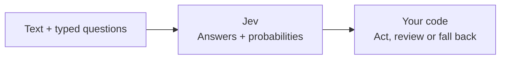

# Jev Skills

A collection of **agent skills, repositories and examples for [TypeSafe Jev](https://typesafe.ai/)**.
Jev answers typed questions about text: choose an option, score it, or return the probability of yes.
Your code decides what happens next.

[🧩 Skills](#-skills) · [📦 Install](#-install) · [🛠️ What you can build](#-what-you-can-build) · [🚀 Projects](#-projects) · [🔌 SDKs & integrations](#-sdks--integrations) · [🧪 Examples](#-examples) · [📚 Learn](#-learn) · [🏠 Open models](#-open-models) · [📊 Evaluations](#-evaluations)

New to Jev? Read the [quickstart](https://docs.typesafe.ai/introduction/quickstart),
install the two [starting skills](#-install), or try an [offline example](#-examples).

## 🧩 Skills

### 📁 In this repo

| Skill | What it helps with |
| --- | --- |
| [jev-builder](skills/jev-builder/SKILL.md) | 🔨 **Build:** find a fitting cookbook, SDK, integration or example. |
| [jev-evidence-eval](skills/jev-evidence-eval/SKILL.md) | 📏 **Evaluate:** measure accuracy, review rate, latency and cost. |
| [jev-curator](skills/jev-curator/SKILL.md) | 🧹 **Curate:** check original sources and keep this collection current. |

### 🌍 Official and community skills

| Skill collection | What it helps with |
| --- | --- |
| [typesafe-ai/skills](https://github.com/typesafe-ai/skills) | ✅ **Official** API, SDK and decision-design guidance. Install from upstream. |
| [altryne/jevify](https://github.com/altryne/jevify) | Delegate bulk reading and repeated semantic checks to Jev. |
| [WanLanglin/jev-skills](https://github.com/WanLanglin/jev-skills) | Shortlist files, triage findings and extract relevant log lines. No repository license at review. |
| [wuyoscar/jev-skill](https://github.com/wuyoscar/jev-skill) | Triage, documents, evaluation, UI and simulation, with recorded examples. |
| [kerpopule/hermes-jev-skills](https://github.com/kerpopule/hermes-jev-skills) | Hermes agent routing, memory, compaction and browser workflows. |
| [aaddrick/building-with-typesafe-jev](https://github.com/aaddrick/building-with-typesafe-jev) | Question design and a map of community decision patterns. |
| [24601/Augustus](https://github.com/24601/Augustus) | Find where a decision model fits, then build, evaluate and improve the system around it. |
| [UditAkhourii/quicksilver](https://github.com/UditAkhourii/quicksilver) | Batch yes/no, label and score tasks from Claude Code. |
| [dbreunig/building-with-jev-skill](https://github.com/dbreunig/building-with-jev-skill) | Question wording, composition and diagnosis. No repository license at review. |

## 📦 Install

Start with the official API skill and this repo's builder skill:

```sh
bunx --bun skills add typesafe-ai/skills --skill typesafe-ai
bunx --bun skills add laguagu/jev-skills --skill jev-builder
```

Choose your agent when prompted, or add `--agent codex`. Add `-g` for a personal installation.
Replace `jev-builder` with `jev-evidence-eval` or `jev-curator` for either companion.
[Plugin and other installation options](INSTALL.md).

## 🛠️ What you can build



| Build | Ask Jev | Start from |
| --- | --- | --- |
| Route tickets | **Choice:** which team, or unknown? | [Routing example](examples/decisions/README.md) |
| Rerank search results | **Noul:** does each result answer the query? | [Rerank example](examples/rerank/README.md) |
| Screen commands | **Score:** how much harm could this command do? | [Risk example](examples/decisions/README.md) |
| Check citations | **Noul:** does the passage fully support the claim? | [Evidence example](examples/evidence/README.md) |
| Select tools | **Choice:** which tool fits, or none? | [Tool selection example](examples/decisions/README.md) |
| Extract source values | **Choice:** which candidate contains the date? | [Date extraction cookbook](https://docs.typesafe.ai/cookbooks/date_extraction_cookbook) |

Read the [official cookbooks](https://docs.typesafe.ai/cookbooks) for worked recipes.
Code handles permissions, thresholds and fallback behavior; measure decisions on your own cases.

## 🚀 Projects

[🤖 Coding agents & MCP](#-coding-agents--mcp) · [🌐 Browser & desktop agents](#-browser--desktop-agents) · [🔎 Search & data](#-search--data) · [🧰 Developer tools](#-developer-tools) · [📱 Applications](#-applications) · [🎮 Games & simulation](#-games--simulation)

Descriptions summarize each project's docs and source; a listing does not mean it was run here.
Sources and repository status checked September 30, 2026.

### 🤖 Coding agents & MCP

- [jev-mcp](https://github.com/jkudish/jev-mcp) — MCP tools for verification, screening, reranking and decision gates.
- [system-one-connector](https://github.com/itsmostafa/system-one-connector) — A general `evaluate` MCP tool; formerly `typesafe-mcp`.
- [jev-router](https://github.com/gargpratyush/jev-router) — Model routing for Claude Code and Codex.
- [fast-jev-compaction](https://github.com/tamaratran/fast-jev-compaction) — Select which tool results survive Claude Code compaction.
- [jev-pruner](https://github.com/tamaratran/jev-pruner) — Trim long Bash output before it reaches the agent.
- [winnow](https://github.com/GhalebDweikat/winnow) — Claude Code hook that replaces unneeded tool-result sections with expandable stubs.
- [jev-skill-router](https://github.com/shimo4228/jev-skill-router) — Claude Code hook for skill suggestions; logs decisions in shadow mode by default.
- [SkillRanker](https://github.com/Dicklesworthstone/skillranker) — Rust CLI that ranks installed agent skills for the next step from the live session.
- [eran-broder/jev-skills](https://github.com/eran-broder/jev-skills) — Claude Code and Codex hooks that load only the skills Jev selects for the current step.
- [Canny](https://github.com/qkal/Canny) — Claude Code and Codex hooks that refuse "done" until a check has passed; Jev's rule judgments add notes but never block.
- [jev-guard](https://github.com/leepokai/jev-guard) — Risk-scores each tool call before it runs: an auto mode for several coding agents.
- [pi-jev](https://github.com/y0usaf/pi-jev) — Pi coding agent extension that gates bash, write and edit calls and adds a `jev_ask` tool.
- [Foreman](https://github.com/thruwire/foreman) — Supervises Codex or OpenCode workers, judging whether a job is complete, tested enough or needs a person.

### 🌐 Browser & desktop agents

- [jev-ultrafast](https://github.com/browser-use/jev-ultrafast) — Browser agent that selects an action and a page element together.
- [Jev for Chrome](https://github.com/chy4pro/jev-for-chrome) — Extension that drives your current tab, choosing each click, keystroke or dropdown value.
- [ts-browser-agent](https://github.com/ndrezn/ts-browser-agent) — Browser action selection through LangChain.
- [agent-desktop](https://github.com/lahfir/agent-desktop) — Desktop automation over accessibility trees; its `jev-desktop` skill picks each operation and its target in one request.
- [typesafe-computer-use](https://github.com/awlevin/typesafe-computer-use) — Mac automation with Jev choosing actions and a text model filling free text. Beta.
- [mobile-jev](https://github.com/droidrun/mobile-jev) — Android action selection over Mobilerun screen controls.
- [Jev Social](https://github.com/socai-io/jev-social) — Read-only research on Instagram, TikTok and LinkedIn, with Jev choosing each next browser step.

### 🔎 Search & data

- [jegrep](https://github.com/can1357/jegrep) — Semantic code search without an embedding index.
- [jevgrep](https://github.com/dzhng/jevgrep) — Repository questions answered with relevant files and verbatim excerpts; includes an agent skill.
- [blink](https://github.com/ellipsis-dev/blink) — Codebase search using parallel walkers guided by Jev. No repository license at review.
- [Jev Search](https://github.com/superagents-lab/jev-search) — Web search in which Jev picks the sources, time range and query, then scores each result.
- [jev-reranker](https://github.com/hotchpotch/jev-reranker) — Python library for reranking and relevance filtering.
- [Vector Graph RAG](https://github.com/zilliztech/vector-graph-rag) — Graph RAG on Milvus with an optional Jev reranker for multi-hop relations.
- [JevPDF](https://github.com/kylemclaren/jevpdf) — Search a PDF by meaning and highlight matching lines.
- [neo4jev](https://github.com/jexp/neo4jev) — Navigate a Neo4j graph by choosing relationships at each hop.
- [sqlite3-jev](https://github.com/mattn/sqlite3-jev) — Ask Choice, Score and Noul questions from SQL.
- [jevQL](https://github.com/kylemclaren/jevql) — A `jev()` function family for plain PostgreSQL, usable from a CLI, an MCP node or SDKs.
- [truffler](https://github.com/kieranklaassen/truffler) — Intent search for Rails with stored labels and query-time reranking.
- [jev-curate](https://github.com/AkashPriyadarshii/jev-curate) — Filter and score large Parquet or JSONL training datasets. Beta.

### 🧰 Developer tools

- [jev-review](https://github.com/devagrawal09/jev-review) — Code review in stages: risk, supporting evidence and severity.
- [Supercov](https://github.com/supercorp-ai/supercov) — Scores code quality and security risk with Jev and turns coverage gaps into tasks for a coding agent.
- [jeview](https://github.com/andududu/jeview) — Local gateway for inspecting requests and answers as they happen.
- [jev-align](https://github.com/sutro-sh/jev-align) — Label uncertain examples and refine question definitions with GEPA.
- [jevcal](https://github.com/abhixhek/jevcal) — Calibrate thresholds and check for drift after model changes.
- [jevals](https://github.com/openlayer-ai/jevals) — Agent-trace evaluations and guardrails.
- [SemDecide](https://github.com/sharziki/semdecide) — Typed decisions in Unix pipelines and CI: pipe text in, get a probability and an exit code.
- [jev-commit](https://github.com/valentynkit/jev-commit) — Pre-commit checks against the staged diff and commit message.
- [jev.nvim](https://github.com/valentynkit/jev.nvim) — Rank functions in a Neovim buffer against a natural-language question.
- [commit-miner](https://github.com/devanshbatham/commit-miner) — Classify commit diffs into fixes, security changes and CWEs. No repository license at review.
- [decision-gate](https://github.com/zachlandes/decision-gate) — Shared rate limits, spend limits and answer caching for decision loops.

### 📱 Applications

- [jev-cookbook](https://github.com/nexibeo/jev-cookbook) — Runnable Node recipes for support triage, tagging, deduplication, search and more.
- [docjev](https://github.com/jerryjliu/docjev) — Classify documents and split document packets using parsed page text.
- [tax-doc-classifier](https://github.com/kyotofin/tax-doc-classifier) — Classify IRS forms page by page, with an evaluation harness.
- [jevmail](https://github.com/fazlerocks/jevmail) — Inbox triage with categories and urgency scores.
- [jev-usecases](https://github.com/kenhuangus/jev-usecases) — Workflow examples that map decisions to automatic action, confirmation or review.
- [Notra](https://github.com/usenotra/notra) — Content platform whose agent uses Jev to choose a fast, everyday or deep model per turn.
- [OpenWork](https://github.com/different-ai/openwork) — Open-source Claude Cowork alternative; its eval testkit can have Jev pick which checked-in checks cover a verification request. Experimental.
- [Shapeshift](https://github.com/anishfn/shapeshift) — A text box that turns into an event card, checklist, timer or poll as you type; Jev classifies the intent when a key is set.
- [unclutter](https://github.com/kitze/unclutter) — Browser extension that hides nonessential page elements and keeps the result as reusable rules.
- [typesafe-adblock](https://github.com/realZachi/typesafe-adblock) — Browser extension demonstrating per-element ad detection.
- [Jev Moderation Bot](https://github.com/brainstormity/Jev-Moderation-Bot) — Discord bot that deletes spam and scam links and escalates repeat offences.
- [Kill My Idea](https://github.com/monteduro/killmyidea) — Scores a startup idea on eight questions and answers kill, fix or ship. No repository license at review.
- [jev-trader](https://github.com/jarrodwatts/jev-trader) — Monad market-making demo with buy-or-sell decisions; simulates fills without a wallet key.
- [Prism](https://github.com/irfndi/prism-liquidity-agent) — Solana liquidity agent whose rule-based rebalancing also asks Jev about toxic flow, holding and deposit shape.

### 🎮 Games & simulation

- [typesafe-mario](https://github.com/fhshaik/typesafe-mario) — Choose Mario actions from structured emulator state. No repository license at review.
- [OneVOneJev](https://github.com/emrickgarrett/OneVOneJev) — Browser arena with a Jev-controlled opponent. No repository license at review.
- [tsai-sc](https://github.com/phyous/tsai-sc) — Jev plays the first StarCraft shareware mission by keyboard and mouse, with recorded action probabilities.
- [Trick Jev](https://trickjev.men/) — Browser game: change Jev's answer one word at a time.
- [jev-drone](https://github.com/RomanSlack/jev-drone) — Camera-only quadrotor in MuJoCo: Jev reads the situation a few times a second while code flies.

## 🔌 SDKs & integrations

### 🧑‍💻 Clients

Links to the `typesafe-ai` organization are official; the others are community clients.

| Language | Client |
| --- | --- |
|  JavaScript / TypeScript | [Official SDK](https://github.com/typesafe-ai/typesafe-sdk-js) · [Advocaat](https://github.com/pithings/advocaat) |
|  Python | [Official SDK](https://github.com/typesafe-ai/typesafe-sdk-python) · [LLM baseline adapter](https://github.com/typesafe-ai/system-one-adapter-python) |
|  Java | [jev-sdk-java](https://github.com/luigivis/jev-sdk-java) · [Spring AI TypeSafe](https://github.com/spring-ai-community/spring-ai-typesafe) |
|  Clojure | [CloJev](https://github.com/antlobach/clojev) |
|  Scala | [zio-typesafe-ai](https://github.com/jamesward/zio-typesafe-ai) |
|  Swift | [TypeSafe](https://github.com/krzyzanowskim/TypeSafe) · [System One for Foundation Models](https://github.com/peterfriese/system-one-foundation-models) |
|  Ruby | [ruby_decision_model](https://github.com/obie/ruby_decision_model) · [RubyLLM judgments](https://github.com/crmne/ruby_llm/blob/main/docs/_core_features/judgments.md) |
|  Elixir | [jev](https://github.com/dannote/jev) |
|  Go | [typesafe-client](https://github.com/haileyok/typesafe-client) · [jev-go](https://github.com/Stumble/jev-go) |
|  Rust | [typesafe-client](https://github.com/haileyok/typesafe-client) · [typesafe-ai](https://github.com/Twister915/typesafe-ai) |
|  .NET | [TypeSafeAI .NET SDK](https://github.com/saibimajdi/typesafeai-dotnet-sdk) |
|  PHP | [typesafe-sdk-php](https://github.com/Butochnikov/typesafe-sdk-php) · [Laravel integration](https://github.com/Butochnikov/laravel-typesafe-jev) |

### 🏗️ Providers & frameworks

-  [Vercel AI Gateway](https://vercel.com/docs/ai-gateway/sdks-and-apis/typesafe) · [AI SDK provider](https://ai-sdk.dev/providers/ai-sdk-providers/typesafe-ai)
-  [OpenRouter](https://openrouter.ai/~typesafe/jev-latest) — Hosted decisions endpoint.
-  [Cloudflare Workers AI](https://developers.cloudflare.com/ai/models/typesafe/jev/) — Jev through a Workers binding.
-  [LangChain](https://docs.langchain.com/oss/python/integrations/providers/typesafe) — Typed classification in a Runnable.
-  [Pydantic AI](https://pydantic.dev/docs/ai/models/typesafe/) — Structured agent outputs through TypeSafe.
- [AG2](https://docs.ag2.ai/docs/user-guide/model_configuration/#typesafe-jev-configuration) — Decision agents for yes/no questions, label selection and rubric scores.
- [eve](https://github.com/vercel/eve/blob/main/docs/guides/evaluate.md) — Vercel's agent framework; its `auto` model selection asks Jev by default.
- [json-render](https://json-render.dev/docs/jev) — Experimental, unreleased UI composition in which Jev chooses components from your catalog.
- [DSPy](https://github.com/stanfordnlp/dspy/tree/main/docs/docs/tutorials/jev_decisions) — Decision types and optimization examples.
- [LanceDB](https://github.com/lancedb/lancedb/blob/main/python/python/lancedb/rerankers/typesafe.py) · [Milvus](https://github.com/milvus-io/milvus-model/blob/main/src/pymilvus/model/reranker/jev.py) — Reranker integrations.
- [Bifrost](https://github.com/maximhq/bifrost/blob/main/docs/providers/supported-providers/typesafe.mdx) · [LiteLLM](https://docs.litellm.ai/docs/pass_through/typesafe) — Gateway integrations.
- [DeepEval](https://github.com/confident-ai/deepeval/tree/main/deepeval/metrics/jev_eval) — Evaluation metrics from typed questions.
- [Opik](https://www.comet.com/docs/opik/integrations/typesafe) — Traces for System One calls.
- [Hono](https://github.com/yusukebe/hono-jev-router) — Experimental router that matches HTTP requests to plain-language descriptions.
- [Home Assistant](https://github.com/AboveColin/HA-Jev) — Typed questions about your home, exposed as entities for automations.

## 🧪 Examples

Small examples included in this repo, with synthetic inputs and offline checks.

| Example | What to try |
| --- | --- |
| [Decisions](examples/decisions/README.md) | Routing, ranking, tool selection, workflow control, risk and answer verification. |
| [Rerank](examples/rerank/README.md) | Rerank a shortlist with a total deadline and the original order as fallback. |
| [Evidence](examples/evidence/README.md) | Check claims against source passages and replay confidence thresholds from saved answers. |

Try a dry run with Node.js 22+; no API key or dependency install needed:

```sh
git clone https://github.com/laguagu/jev-skills.git
cd jev-skills
node examples/decisions/run.mjs routing --dry-run
```

## 📚 Learn

- [TypeSafe documentation](https://docs.typesafe.ai/introduction) — Concepts, primitives and API reference.
- [Jev with coding agents](https://docs.typesafe.ai/introduction/coding-agents) — How the official skill helps an agent write code that uses Jev.
- [Official cookbooks](https://docs.typesafe.ai/cookbooks) — Worked recipes for routing, retrieval, verification and interactive apps.
- [Use-case map](https://docs.typesafe.ai/concepts/use-case-map) — Find where a typed decision fits.
- [Confidence guide](https://docs.typesafe.ai/confidence) — Decide when to accept, review or fall back.
- [Building a harness with Jev](https://www.langchain.com/blog/building-a-harness-with-jev) — Routing and tool screening with LangChain.
- [Search with Jev and Milvus](https://github.com/milvus-io/bootcamp/tree/master/bootcamp/RAG/search_with_jev) — Nine notebooks: reranking, context filtering, query routing, cache reuse and knowing when to stop searching.
- [The Top 20 Jev Skills](https://charliehills.substack.com/p/the-top-20-jev-skills) — Charlie Hills' tour of agents, tools and demos.

### 🗂️ More collections

- [yibie/awesome-jev](https://github.com/yibie/awesome-jev) — Projects grouped by use case. No repository license at review.
- [kraayenjon/awesome-jev](https://github.com/kraayenjon/awesome-jev) — Builds, SDKs, guides and community resources.
- [heyjunpenn/awesome-jev](https://github.com/heyjunpenn/awesome-jev) — A large catalog of open-source projects with a searchable website.
- [Anil-matcha/awesome-jev-by-typesafe](https://github.com/Anil-matcha/awesome-jev-by-typesafe) — Use cases, prompt patterns and starter code.
- [cobanov/awesome-jev](https://github.com/cobanov/awesome-jev) — Projects with public source and reproducible evidence.
- [logicrw/awesome-jev-projects](https://github.com/logicrw/awesome-jev-projects) — Entries tied to source commits and decision points.
- [AbdelStark/awesome-typesafe-jev](https://github.com/AbdelStark/awesome-typesafe-jev) — Field guide with SDKs, runnable projects and an agent skill.
- [OmniJev/awesome-jev-gallery](https://github.com/OmniJev/awesome-jev-gallery) — Papers, open models and evaluations.

Thanks to these collections and Charlie Hills for discovery leads. Descriptions here are written from the linked primary sources.

## 🏠 Open models

Alternatives for exploring the decision-model interface locally. They are separate models with
their own behavior; their probabilities and thresholds are not interchangeable with Jev's.

- [kev](https://github.com/jaredpalmer/kev) — Open decision models, training code and a System One API server.
- [Laya](https://github.com/NandhaKishorM/laya) — Local decision models for the three primitives.
- [Ollaya](https://github.com/ollaya-dev/ollaya) — Pull and serve Laya, decider and other open decision models behind a TypeSafe-compatible API, plus an MCP server.
- [Laya-MLX](https://github.com/mizorewww/laya-mlx) — Runs Laya checkpoints natively on Apple Silicon.
- [SemIf-OpenJev](https://github.com/TheoLeeCJ/SemIf-OpenJev) — Typed decisions from open models, including a browser demo.
- [simple-jev](https://github.com/featherless-ai/simple-jev) — Choices, scores and yes probabilities from model logits.
- [decider](https://github.com/Mapika/decider) — Qwen3.5 fine-tunes that answer typed questions in one forward pass.
- [Von](https://github.com/wfzyx/von) — A non-autoregressive decision model for choices, probabilities and ordinal scores.
- [NanoJev](https://github.com/TianyuCodings/NanoJev) — A 0.6B parallel decision model with its training pipeline and game demos.
- [jevos](https://github.com/feder-cr/jev) — Yes/no probabilities on a laptop CPU.
- [Jevlike](https://github.com/vinnylarouge/jevlike) — Train a small model that picks among a changing list of text options.
- [litjev](https://github.com/zhengxuyu/litjev) — Decision API experiments on Qwen checkpoints.
- [AnyJev](https://github.com/nokia-applied-research/AnyJev) — Calibration heads for open models, served through vLLM.

### Skills for open models

Skills for the open alternatives below. Install from upstream; thresholds and probabilities are
specific to each model, so measure on your own cases.

| Skill | What it helps with |
| --- | --- |
| [kev-finetune](https://github.com/jaredpalmer/kev/tree/main/skills/kev-finetune) | **Official Kev:** draft a workload from your Jev call sites, fine-tune on Modal and check the numbers. |
| [kev-deploy](https://github.com/jaredpalmer/kev/tree/main/skills/kev-deploy) | **Official Kev:** deploy a Kev server with the Jev-compatible `/v1/systemone` API. |
| [laya-integration](https://github.com/wdobry/laya-playground/tree/main/skills/laya-integration) | Community: add Laya to a project with working questions, thresholds and calibration. |
| [ollaya-decisions](https://github.com/ollaya-dev/ollaya/tree/main/skills/ollaya-decisions) | Community: when and how to use local decision models through `ollaya mcp`. |

```sh
bunx --bun skills add ollaya-dev/ollaya --skill ollaya-decisions
```

## 📊 Evaluations

- [TypeSafe workflow evals](https://evals.typesafe.ai) — The provider's workflow measurements.
- [S1Rank](https://github.com/zaesho/S1Rank) — Retrieval benchmarks, calibration and raw responses.
- [ASSAY-001](https://github.com/jourdanlabs/assay-001) — Pre-registered calibration and type-safety check on two intent datasets, with every raw response. No repository license at review.
- [sysone-bench](https://github.com/instax-dutta/sysone-bench) — Decision models compared on matching inputs.
- [jev-spam-eval](https://github.com/bitnovus/jev-spam-eval) — Email classification against a trained baseline.
- [JevBench](https://github.com/fstandhartinger/jevbench) — Decision-model comparisons.
- [jev-rerank-bench](https://github.com/laguagu/jev-rerank-bench) — Our own Finnish retrieval, classification and citation runs, with [lessons for builders](https://github.com/laguagu/jev-rerank-bench#lessons-for-builders).

## 🔄 Keep the collection current

Ask your agent:

> Use jev-curator to find useful new Jev repos and skills, check the original sources, and update this README.

In a checkout, the agent can read [the skill](skills/jev-curator/SKILL.md) directly.
Contributions welcome: link the original project and explain its use in one sentence.

Independent community collection. [MIT license](LICENSE); linked projects have their own licenses.
